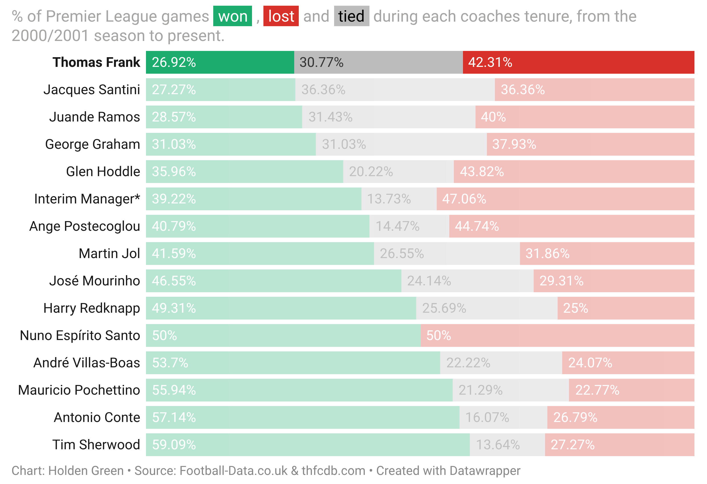
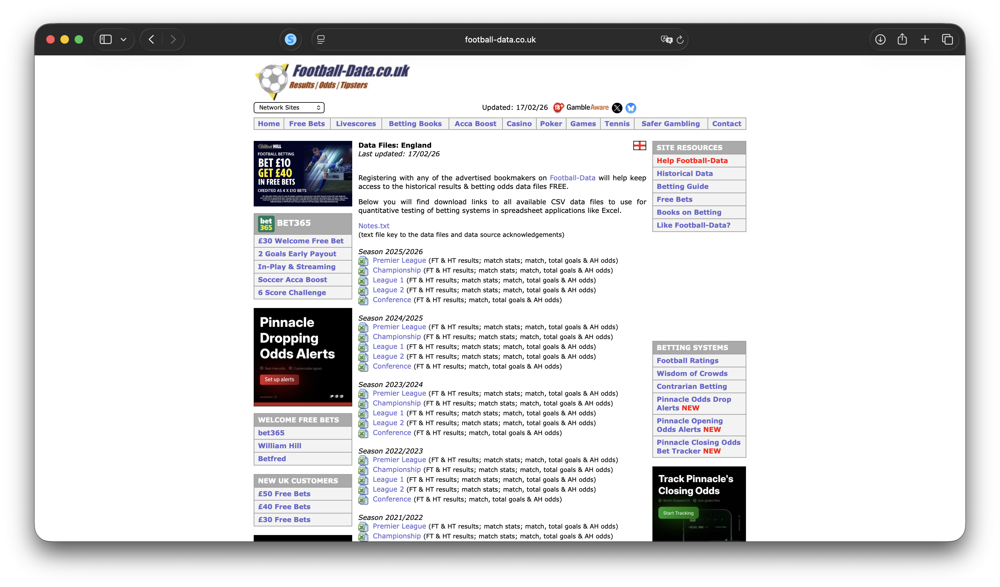
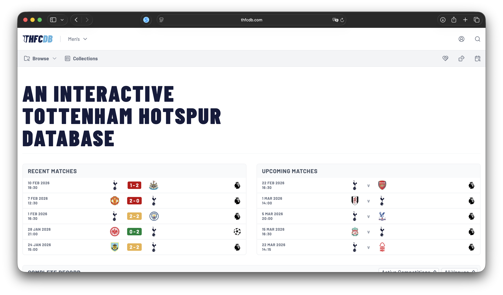
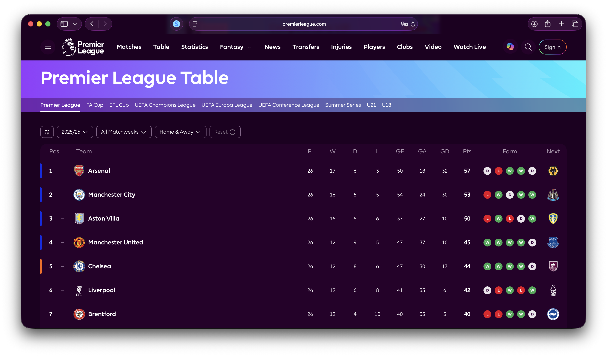

# Analysis of Thomas Frank's Tenure at Tottenham Hotspur Football Club

Created by **[Holden Green](https://hgorledeenn.github.io)** in February 2026 <br>
Columbia Journalism School, Data Studio

<br>

## The Project
This story was concieved following Thomas Frank's removal from his position as head coach at the Tottenham Hotspur Football Club. I did original data analysis and research and published just a few days later, combining data from a multiple sources to analyze Frank's tenure in the context of other 2000s-era Spurs coaches.
<br><br>
> **<big>An excerpt from the story:</big>**
>
>*Thomas Frank was removed from his post as Head Coach of the Tottenham Hotspur men's team last week. He was appointed in the summer of 2025 and has spent the better part of the current season at the helm in North London.*
>
>*Despite a strong showing in the Champions League (which Spurs qualified for by winning the Europa league under Frank’s predecessor, Ange Postecoglou), the board thought Spurs’ recent results meant “a change at this point in the season is necessary,” according to a club statement. The team currently sits at 16th in the table, just 5 points clear of the relegation zone, and haven’t won a game in 2026.*

<br>

## Findings
The most interesting thing I found was that Frank had the lowest league game win rate of any coach since the 2000/01 season.
<p align="center">

</p>

## Data Collection and Wrangling
The data for this project came from a few sources and required extensive wrangling. Almost all of the code is contained in the notebook `data_analysis.ipynb`. I also used a scraper to quickly gather the table results for one visualization; the code for that scraper is in `pl_results_scraper.ipynb`.

### <b>(1) [Football-Data.co.uk](https://www.football-data.co.uk/englandm.php) </b>

<p align="center">

</p>
I got most of my team performance data from Football-Data.co.uk, a website with season-by-season results for all Premier League games from the 1993/94 season - present.

Once I had the csvs downloaded, I needed to read them into one dataframe and clean the data. Some of my steps were:

(1) Filter the full dataset to only games where Tottenham was the home team or the away team
```python
only_tot = all_games[(all_games['HomeTeam'] == 'Tottenham') | (all_games['AwayTeam'] == 'Tottenham')]
```

(2) Learn and use the `np.where` function and used it to create a new dataframe that organizes the same stats from a Tottenham-focused view (as opposed to stats being, for instance, "Home Team Shots" and "Away Team Shots", my dataframe had "Tottenham Shots" and "Other Team Shots"). A few examples of how I used `np.where` are below:
```python
tottenham['OT'] = np.where(only_tot['HomeTeam'] == 'Tottenham', only_tot['AwayTeam'], only_tot['HomeTeam'])

tottenham['TL'] = np.where(only_tot['HomeTeam'] == 'Tottenham', "H", "A")

tottenham['TFTG'] = np.where(only_tot['HomeTeam'] == 'Tottenham', only_tot['FTHG'], only_tot['FTAG'])
```

### <b>(2) [thfcdb.com](https://www.thfcdb.com)</b>

<p align="center">

</p>

I also brought in some data from THFCDB.com, specifically using their [manager history](https://thfcdb.com/collections/manager-history) data to create my own dictionary of coach timelines.

(1) I manually entered coach names and dates as a dataframe in my notebook (see an excerpt of the dictionary below).
```python
...
{"coach":"Thomas Frank","start":"2025-06-07","end":"2026-02-11"},
{"coach":"Igor Tudor","start":"2026-02-12","end":"2026-03-01"}
]

coach_df = pd.DataFrame(coaches)
coach_df["start"] = pd.to_datetime(coach_df["start"])
coach_df["end"]   = pd.to_datetime(coach_df["end"])
```

I used this coaching data to create a new dataframe summarizing the coaches' stats across their tenures. This dataset ended up being the main one I used to visualize the data for readers.

### <b>(3) [PremierLeague.com](https://www.premierleague.com/en/tables/premier-league/2025-26)</b>

<p align="center">

</p>

 I manually compiled historical position data for Tottenham from the official [Premier League table](https://www.premierleague.com/en/tables/premier-league/2025-26). This powered one of my visualizations

<br>

<br>
<br>
<br>
<br>
<br>
<br>
<br>


#### LIMITATIONS
*Only includes league games, obvs frank coaches non-league games too, and spurs are doing well in the champions league which I didn't represent in the visualizations/isn't seen in the data, but is mentioned in the text of the story.*


# project-1-spurs


Short description of what you aimed to accomplish
Short description of your findings
Summary of the data collection process, with links
Overview of the data analysis process
A section about what new skills, approaches, etc you used, or where you grew the most during the project
A section about things you tried to do or wanted to do but did not have the skills/time (but if you have more time you might do)


### Data Diary for my columns:
<b>Season</b>: Season of the game (in the format 0203, where the season spanned 2002 and 2003)
<br><b>Date</b>: Date of the game
<br><b>OT</b>: The team Tottenham played
<br><b>TL</b>: The location of the game, from Tottenham's perspective (H = Home, A = Away)
<br><b>TFTG</b>: Tottenham Full-Time Goals
<br><b>OTFTG</b>: Other Team Full-Time Goals
<br><b>FTR</b>: Full Time Result (W if Tottenham win, L if Tottenham loss, D if draw)
<br><b>THTG</b>: Tottenham Half-Time Goals
<br><b>OTHTG</b>: Other Team Half-Time Goals
<br><b>HTR</b>: Half Time Result (W if Tottenham winning, L if Tottenham losing, D if tied)
<br><b>TS</b>: Total shots by Tottenham
<br><b>OTS</b>: Total shots by the Other Team
<br><b>TST</b>: Tottenham shots on target
<br><b>OTST</b>: Other Team shots on target
<br><b>FTGD</b>: Full-Time goal differential (+ if Tottenham won, - if Tottenham lost, 0 if draw)
<br><b>HTGD</b>: Half-Time goal differential (+ if Tottenham won, - if Tottenham lost, 0 if draw)